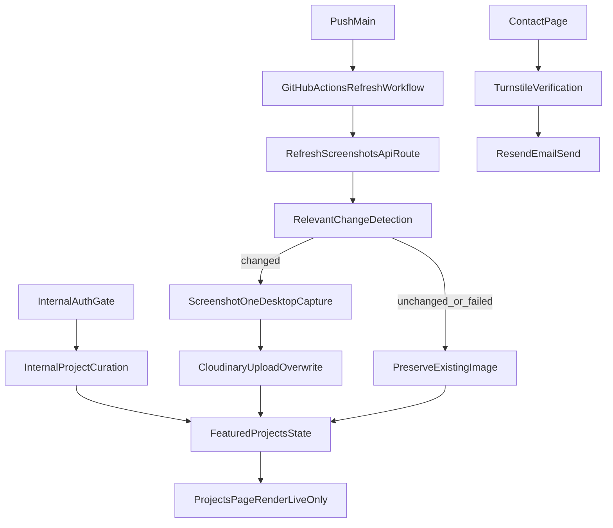

# Portfolio V2 Implementation Plan

## Use This Document When

- Sequencing work across phases and defining release scope.
- Reviewing launch acceptance criteria before merge/release.
- Validating planned code areas against current implementation tasks.

## Scope

Ship a clean, fast portfolio V2 focused on clarity and credibility: curated projects, reliable screenshots, a simple contact path, and baseline SEO.

## Architecture

## Phases

## Phase 1: Documentation and Contracts

- Finalize decision and integration docs.
- Freeze environment variable contract.
- Define event names for analytics.

Exit criteria:

- `docs/decisions.md` reflects latest scope.
- `docs/integrations.md` includes all providers and secrets.

## Phase 2: Data Foundation

- Add data structures for featured projects and screenshot state.
- Add server functions for:
  - featured project CRUD
  - repo sync metadata
  - screenshot fingerprint comparison

Exit criteria:

- Data layer and server functions compile.
- Internal management and public routes can read featured project records.

## Phase 3: Protected Internal Curation

- Add protected internal curation surface.
- Authenticate internal access.
- Add selection/toggle controls for featured repos.
- Persist curation in application data storage.

Exit criteria:

- Non-authenticated users cannot access internal curation.
- Authorized operators can curate featured repos and save changes.

## Phase 4: Public Projects and Screenshot Policy

- Update project page to render curated live projects only.
- Implement relevant-change detection before screenshot refresh.
- Preserve existing Cloudinary URL on failures/quota limits.

Exit criteria:

- `/projects` never displays non-live or unfeatured repos.
- Screenshot job skips unchanged projects.
- Failed refresh keeps previous screenshot URL.

## Phase 5: Contact and SEO

- Add `/contact` route and submission endpoint.
- Validate Turnstile token and send via Resend.
- Add metadata, sitemap, robots, OG defaults.

Exit criteria:

- Contact submissions succeed with valid Turnstile token.
- SEO files/routes are generated and valid.

## Phase 6: Cleanup, Quality, Release

- Exclude blog from shipped route surface for this phase.
- Keep future blog plan documented only.
- Add test coverage for critical paths.
- Execute pre-merge quality checklist.

Exit criteria:

- `bun run lint`, `bun run typecheck`, and `bun run build` pass.
- Required tests pass.
- Release checklist is complete.

## Phase 7: Post-Launch Enhancements (Optional)

Do not block launch on the items below. Add only if there is clear user value and low implementation risk.

- Project detail route (`/projects/[slug]`) for deeper case studies.
- Skills proof section with evidence links.
- Project filtering and search.

Exit criteria:

- Core launch criteria are complete first.
- Optional items are added only when they do not delay release.

## Acceptance Criteria (Launch)

- Portfolio displays only curated repos with valid live URLs.
- Internal curation is private and auth-gated.
- Screenshot refresh runs only for relevant changes.
- Previous screenshot is preserved when refresh fails.
- Contact form is protected by Turnstile and delivered via Resend.
- Resume/CV is reachable in one click from global navigation.
- Basic SEO outputs are present and valid.
- `bun run lint`, `bun run typecheck`, and `bun run build` pass.

## Optional Criteria (Post-Launch)

- Homepage includes a secondary CTA to view/download resume.
- Resume asset is available at `/cv/resume.pdf` and opens without auth.
- Skills section is present and includes evidence links to shipped portfolio work.
- Projects page supports filtering by stack/category.

## Planned Code Areas

- Existing:
  - `app/page.tsx`
  - `app/projects/page.tsx`
  - `lib/projects.ts`
  - `components/**` (homepage and project UI composition)
  - screenshot refresh API route
  - `components/site-nav.tsx`
  - `lib/github.ts`
  - `lib/cloudinary.ts`
  - `lib/screenshotone.ts`
  - `lib/screenshot-store.ts`
- New:
  - `public/cv/resume.pdf`
  - internal curation route
  - `app/contact/**`
  - `lib/analytics/**` (or equivalent)
  - `app/projects/[slug]/page.tsx` (optional post-launch)

## Open Visual Tokens

- Keep visual system mostly black with lighter purple as secondary accent.
- Animation timing and targets should remain subtle and non-essential.
